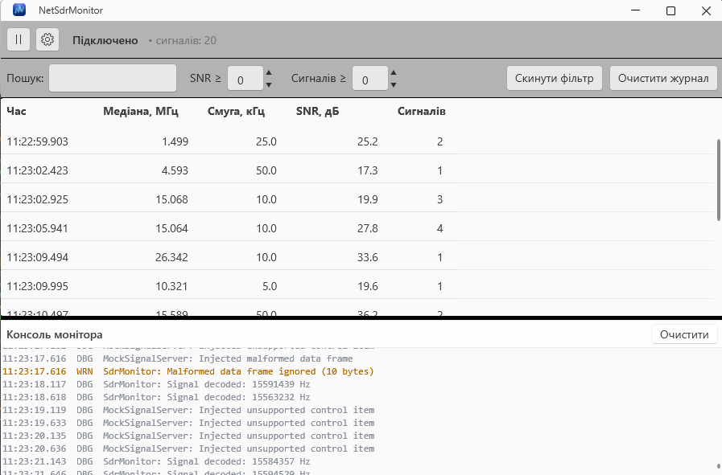
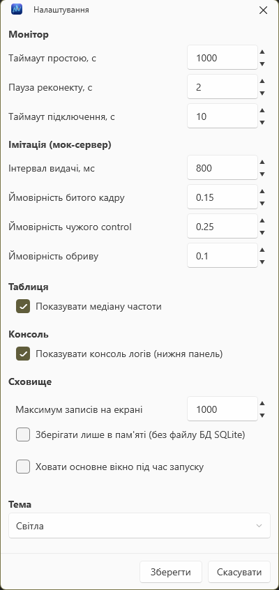
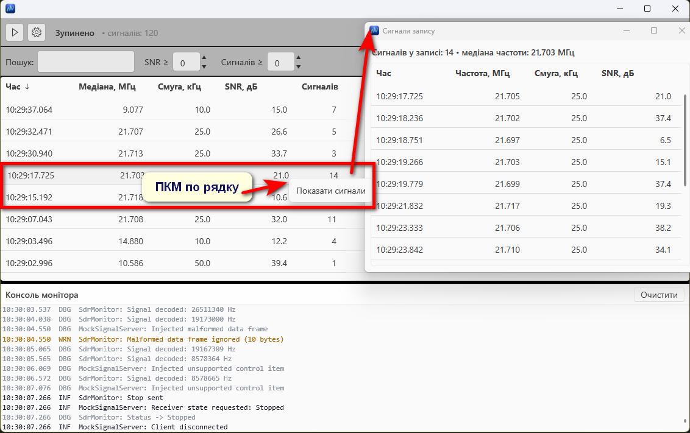
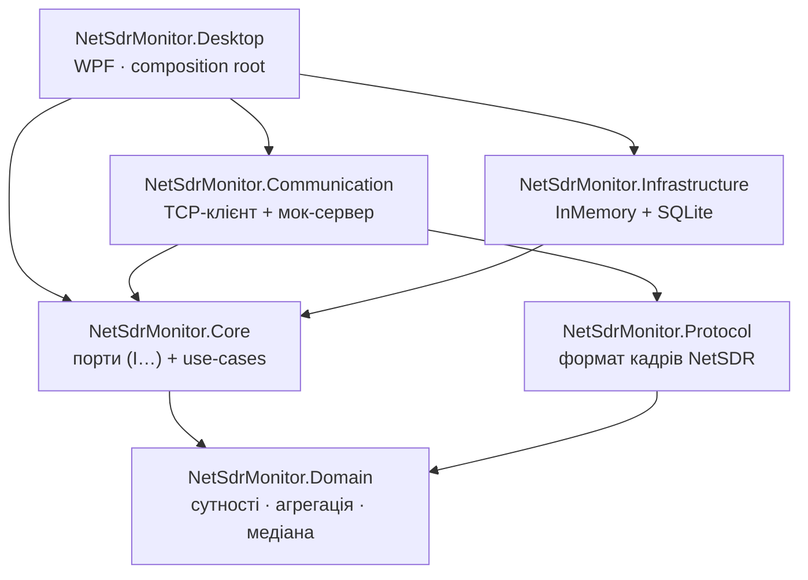

# NetSdrMonitor

Десктопний монітор сигналів приймача **NetSDR**: підключається до лінії даних, розбирає
кадри за протоколом NetSDR, **агрегує детекції в записи** (рядок таблиці = група сигналів довкола
однієї частоти) і показує їх у реальному часі. Частота рядка рахується як **медіана** частот усіх
детекцій запису, стійко до викидів, на відміну від «першого сигналу».

Стек: **.NET 10, WPF, MVVM**. У комплекті — власний **мок-сервер**, що імітує роботу таргета
(потік сигналів, биті кадри, чужі control item-и, обриви з'єднання), тож застосунок повністю
самодостатній для демонстрації без реального обладнання.

---

## Скриншоти

**Головне вікно** - таблиця агрегованих записів, панель керування, фільтр і нижня консоль логів:



| Налаштування | Деталізація запису |
|---|---|
|  |  |

> Консоль монітора показує живу роботу лінії: прийом сигналів, підключення/реконекти, відкинуті биті
> кадри та NAK на непідтримувані команди.

---

## Можливості

- **Прийом і агрегація** потоку сигналів у записи; частота - за **медіаною** (або за першим сигналом).
- **Таблиця** з фільтрацією (пошук по всіх колонках, поріг SNR і кількості), сортуванням по колонках,
  **перетягуванням і зміною ширини колонок** - порядок і ширина зберігаються між запусками.
- **Деталізація запису** (ПКМ → «Показати сигнали») - усі детекції, що увійшли в медіану.
- **Нижня консоль логів** із роздільником (висота запам'ятовується); вмикається в налаштуваннях.
- **Сховище** записів: в пам'яті або файлове **SQLite** (перемикається галочкою).
- **Стійкість лінії**: авто-реконект із backoff, idle-таймаут, обробка битих кадрів і NAK.
- **Системний трей**: тихий старт, налаштування таймаутів і «хаосу» мок-сервера.

---

## Технології

- **WPF (.NET 10)**, патерн **MVVM** (`CommunityToolkit.Mvvm`).
- **DI та логування**: `Microsoft.Extensions.DependencyInjection` / `Microsoft.Extensions.Logging`
  (логи монітора й мока виводяться у внутрішню консоль через власний sink).
- **Сховище**: `Entity Framework Core` + `Microsoft.Data.Sqlite` (та реалізація в пам'яті).
- **Трей**: `Hardcodet.NotifyIcon.Wpf`. **Тема**: Fluent 2 (`WPF-UI`).
- **Тести**: `xUnit` (модульні + інтеграційні на loopback-TCP та SQLite).

---

## Запуск

1. Потрібен **Windows** і **.NET 10 SDK**.
2. Відкрити `NetSdrMonitor.slnx` у Rider або Visual Studio 2022+.
3. Стартовий проєкт - **`NetSdrMonitor.Desktop`**, запустити (F5).
4. Застосунок одразу піднімає мок-сервер на loopback і починає імітацію.

Тести:

```bash
dotnet test NetSdrMonitor.slnx
```

---

## Архітектура: гібрид (чисте ядро + feature-папки)

Архітектура **гібридна**: «чисте» ядро за шарами (Domain → Core → Infrastructure → Presentation),
а *всередині* шарів Core і Presentation - організація **за фічами** (feature folders), в дусі VSA без церемоній MediatR.

**Чому не чистий VSA.** Вертикальні зрізи з MediatR (`request → handler` на кожен HTTP-ендпоінт) - це
вебова/бекенд-ідіома. У десктопа точка входу не запит, а **довгі потоки даних + команди UI**, і MVVM
вже дає вертикальну нарізку за екранами/фічами. Тому беремо чисті межі заради тестованості ядра
плюс feature-папки заради когезії - це ідіоматично для WPF.

### Правило залежностей

Залежності спрямовані **всередину, до ядра**. UI та інфраструктура залежать від абстракцій; конкретику
(TCP, SQLite) знає лише композиційний корінь `NetSdrMonitor.Desktop` - і зв'язує її один раз у `App.xaml.cs`.



**Ключовий інваріант:** ViewModels залежать лише від портів `NetSdrMonitor.Core`, а не від TCP чи SQLite.
Завдяки цьому ядро (домен, протокол, агрегація) тестується й збирається без UI.

### Проєкти

| Проєкт | Призначення | Залежить від |
|---|---|---|
| `NetSdrMonitor.Domain` | Сутності, value-об'єкти, доменні сервіси (агрегація, інкрементальна медіана). Чистий C#, без I/O. | - |
| `NetSdrMonitor.Core` | Порти (`I…`) та use-case-сервіси, організовані за фічами. | Domain |
| `NetSdrMonitor.Protocol` | Формат повідомлень NetSDR: заголовок, payload, Control Items, NAK/ACK. | Domain |
| `NetSdrMonitor.Communication` | Транспорт (TCP, InMemory), монітор лінії та **мок-сервер**. | Core, Protocol, Domain |
| `NetSdrMonitor.Infrastructure` | Репозиторії записів: InMemory та SQLite (EF Core). | Core, Domain |
| `NetSdrMonitor.Desktop` | WPF-застосунок: Views/ViewModels за фічами, DI-бутстрап, налаштування, трей, теми. | усе вище |
| `NetSdrMonitor.UnitTests` | Модульні тести: Domain, Protocol, Core. | відповідні |
| `NetSdrMonitor.IntegrationTests` | Транспорт по реальному TCP (loopback), репозиторій SQLite. | Communication, Infrastructure |

### Структура рішення

```
NetSdrMonitor.sln(x)
├── NetSdrMonitor.Desktop        (застосунок, точка входу)
├── Libraries/                   (шари ядра - class library)
│   ├── NetSdrMonitor.Domain
│   ├── NetSdrMonitor.Core
│   ├── NetSdrMonitor.Protocol
│   ├── NetSdrMonitor.Communication
│   └── NetSdrMonitor.Infrastructure
└── Tests/
    ├── NetSdrMonitor.UnitTests
    └── NetSdrMonitor.IntegrationTests
```
### Автоматизація розробки
- Summary — здебільшого були згенеровані за допомогою ШІ.
- Написання тестів — частково автоматизована ШІ.
- Розробка UI — частково автоматизована ШІ.
- Пошук найефективніших алгоритмів побудови транспортного шару — кооперативна робота із ШІ + застосування Best Practices
- README — згенеровано за допомогою ШІ, після чого відредаговано вручну